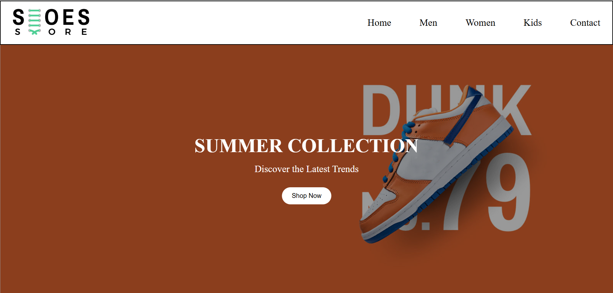
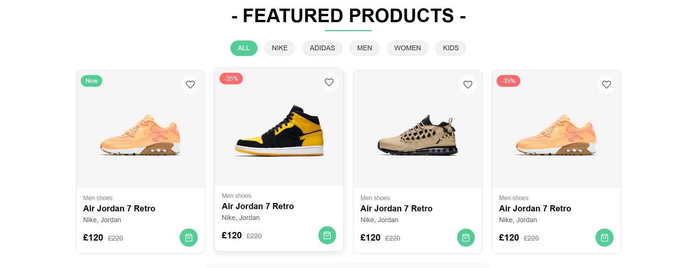
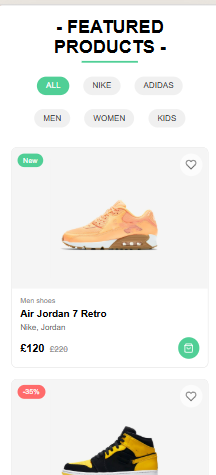

# Landing Page

A modern and responsive landing page built using Next.js and deployed on Vercel.

## 🚀 Live Demo

[Click here to view the live site](https://landing-page-ochre-sigma-96.vercel.app/)

## 📌 Features

- 🔥 **Fast & Responsive** – Optimized for all devices.
- 🎨 **Clean UI** – Modern and minimalistic design.
- ⚡ **Deployed on Vercel** – Ensures high performance.
- 📜 **SEO Friendly** – Basic meta tags included.

## 🛠 Tech Stack

- **Frontend:**  React
- **Styling:**  CSS 
- **Hosting:** Vercel

## 📂 Installation & Setup

To run this project locally:

```bash
git clone [https://github.com/FahimSk-dotcom/LandingPage.git]
cd LandingPage
npm install
npm run dev
```

Then visit `http://localhost:3000/` in your browser.

## 📸 Screenshot








## 📸 Demo Video


